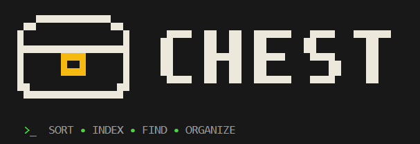

# CHEST

<center>

</center>

> **Give CHEST a folder, tell it how you want the files organized, and CHEST puts them into the right compartments.**

CHEST is a file organization, indexing, and automation CLI tool built in Go, inspired by the Minecraft chest. It focuses on deterministic sorting, reversible operations, fast searching, and an extensible architecture.

---

## Installation

### Option 1: Go Install
```bash
go install github.com/Aswanidev-vs/chest/cmd/chest@latest
```
Ensure your Go bin path (`$GOPATH/bin` or `%USERPROFILE%\go\bin`) is included in your system `PATH`.

### Option 2: Shell Script (Linux & macOS)
```bash
curl -sSL https://raw.githubusercontent.com/Aswanidev-vs/chest/main/install.sh | bash
```

### Option 3: PowerShell (Windows)
```powershell
irm https://raw.githubusercontent.com/Aswanidev-vs/chest/main/install.ps1 | iex
```

### Option 4: Build from Source
```bash
git clone https://github.com/Aswanidev-vs/chest.git
cd chest
make build
```

---

## Core Features

- **Concurrent Search Engine**: Built using `fastwalk` for parallel directory traversal and `fzf/src/algo` for exact and fuzzy scoring. Supports filtering by file category, extension, size, modification date, and in-file content grep.
- **Rule-Based Organization**: Sort by extensions, categories, file size boundaries, and dates. Define custom rules on the CLI or use built-in presets (`downloads`, `media`, `documents`, `developer`, `photos`).
- **Safety First**:
  - Full dry-run preview (`chest sort --dry-run` or `-n`) before files move.
  - Interactive confirmations.
  - Built-in collision policies: `skip`, `rename`, `replace`, or `abort`.
  - Comprehensive operation logging and rollbacks via `chest undo`.
- **Folder Watch Automation**: Monitor directories continuously with `chest watch`. New files are picked up via filesystem events (`fsnotify`) and sorted automatically with debounce safeguards.
- **Local Indexing & Analysis**:
  - Incremental metadata and SHA256 hashing backed by pure-Go SQLite (`ncruces/go-sqlite3`).
  - Storage analytics with `chest stats`.
  - Exact duplicate file detection with `chest duplicates`.
  - Stale and zero-byte file reports with `chest analyze`.
  - Cache management with `chest index --clear` and `chest clean`.
- **Local Indexing & Analysis**:
  - Incremental metadata and SHA256 hashing backed by pure-Go SQLite (`ncruces/go-sqlite3`).
  - Storage analytics with `chest stats`.
  - Exact duplicate file detection with `chest duplicates`.
  - Stale and zero-byte file reports with `chest analyze`.
  - Cache management with `chest index --clear`, `chest undo cache --clear`, and interactive `chest clean`.
- **System Path Protection Guard**:
  - Automatic safeguards preventing modification to OS root volumes (`/`, `C:\`) and system paths (`C:\Windows`, `C:\Program Files`, `/etc`, `/usr`, `/var`, etc.).
  - Protected paths remain completely accessible for read-only commands (`search`, `stats`, `duplicates`, `analyze`, `index`).
  - Dangerous operations (`sort`, `watch`, `undo`) require explicit `--allow-system` override with confirmation.
- **Plugin Architecture**: Extend classification and rule handling through independent external processes using `hashicorp/go-plugin` over standard RPC.

---

## Command Reference

| Command | Description | Example |
|---|---|---|
| `chest sort` | Sort files using presets, flags, or custom rules (`--allow-system` for OS dirs) | `chest sort ~/Downloads -t -p downloads` |
| `chest search` | Search files by name, metadata, or file content grep | `chest search "report" -e pdf -c "invoice"` |
| `chest watch` | Continuously watch and organize incoming files (`--allow-system` guard) | `chest watch ~/Downloads --preset media` |
| `chest history` | View previous operations log | `chest history` |
| `chest undo` | Revert latest operation or specific ID, auto-cleaning empty created directories | `chest undo` or `chest undo 3` |
| `chest undo cache` | Inspect undo cache or wipe all history (`--clear`) | `chest undo cache --clear` |
| `chest index` | Index directory metadata into local SQLite | `chest index ~/Documents --hash` |
| `chest stats` | Display storage consumption and category breakdown | `chest stats` |
| `chest duplicates` | Locate duplicate files using cryptographic hashes | `chest duplicates ~/Downloads` |
| `chest analyze` | Read-only audit of storage distribution and old files | `chest analyze ~/Downloads` |
| `chest plugin` | Manage external plugins (`list`, `info`, `install`, `remove`) | `chest plugin list` |
| `chest clean` | Clear cached SQLite index with confirmation (`-y` to skip, `--all` for DB) | `chest clean -y` |
| `chest man` | Display detailed manual page with examples (like Linux man) | `chest man sort` |
| `chest preset` | List available built-in sorting presets | `chest preset` |
| `chest version` | Display version and build architecture | `chest version` |

---

## Plugin API & Extending Engine Tools

CHEST provides an external plugin architecture powered by **`hashicorp/go-plugin`** over standard IPC/RPC. Rather than creating isolated standalone tools, CHEST plugins are designed to directly plug into and extend the core engine tools (`sort`, `search`, `watch`, `classifier`).

### How the Plugin System Interacts with the Engine

```
 ┌─────────────────────────────────────────────────────────────┐
 │                         CHEST Core                          │
 │                                                             │
 │   CLI Tools (sort / watch / search)                         │
 │         │                                                   │
 │         ▼                                                   │
 │   Rule Engine & Classifier                                  │
 │         │                                                   │
 │         ▼                                                   │
 │   Plugin Manager (~/.chest/plugins)                         │
 └─────────┬───────────────────────────────────────────────────┘
           │  HashiCorp RPC Protocol (Unix socket / Local pipe)
           ▼
 ┌─────────────────────────────────────────────────────────────┐
 │                      External Plugin                        │
 │                                                             │
 │   [Manifest]        Name, Version, Capabilities             │
 │   [Classifier]      Classify(filename, ext) -> Category    │
 │   [Rule Provider]   GetCustomRules() -> []models.Rule       │
 └─────────────────────────────────────────────────────────────┘
```

When someone builds a plugin for CHEST, the goal is **not** to reinvent file operations, but to feed custom domain intelligence directly into CHEST's existing execution engine:

1. **Extending File Classification (`Classify`)**:
   - The built-in classifier categorizes common extensions (`jpg` -> Image, `go` -> Code).
   - A plugin overrides or expands classification for specialized domain files (e.g., classifying DICOM `.dcm` files as `MedicalImaging`, or `.spec.ts` as `UnitTests`, or audio stems `.stem.mp4` as `MusicProduction`).
   - The engine tools (`sort`, `watch`, `search -t`) automatically adopt these custom categories when evaluating conditions.

2. **Injecting Dynamic Engine Rules (`GetCustomRules`)**:
   - Plugins can return a slice of `models.Rule` structs with custom priority, conditions (extension, size, regex, date), and compartment destinations.
   - These rules are injected directly into the `rules.Engine`, allowing plugins to provide domain-specific sorting presets without modifying CHEST source code.

3. **Process Isolation & Language Independence**:
   - Plugins execute as separate child processes communicating over RPC. A crash in a third-party plugin cannot crash the main CHEST engine or corrupt the filesystem.
   - Plugins can be developed in Go or any language supporting standard gRPC / HashiCorp plugin handshakes.

### Creating a Plugin: Minimal Implementation

#### 1. Define the Plugin Service (`main.go`)

```go
package main

import (
    "strings"
    hplugin "github.com/hashicorp/go-plugin"
    "github.com/Aswanidev-vs/chest/internal/models"
    "github.com/Aswanidev-vs/chest/internal/plugin"
)

type DomainClassifier struct{}

// Return plugin metadata and declared capabilities
func (c *DomainClassifier) GetInfo() (plugin.Manifest, error) {
    return plugin.Manifest{
        Name:         "code-artifacts",
        Version:      "1.0.0",
        Description:  "Classifies developer build artifacts and test reports",
        Author:       "Community",
        Capabilities: []string{"classifier", "rule"},
        Binary:       "code-artifacts",
    }, nil
}

// Extend existing engine classification
func (c *DomainClassifier) Classify(name string, ext string) (string, error) {
    if strings.HasSuffix(name, ".coverage.out") || strings.HasSuffix(name, ".lcov") {
        return "CoverageReports", nil
    }
    if ext == "wasm" {
        return "WebAssembly", nil
    }
    return "", nil // Return empty string to fallback to default engine classifier
}

// Inject custom sorting rules directly into chest sort & watch
func (c *DomainClassifier) GetCustomRules() ([]models.Rule, error) {
    return []models.Rule{
        {
            Name:        "WASM Artifacts",
            Priority:    50,
            Destination: "Build/Wasm",
            Conditions: []models.Condition{
                {Field: models.FieldExtension, Operator: models.OpEqual, Value: "wasm"},
            },
        },
    }, nil
}

func main() {
    hplugin.Serve(&hplugin.ServeConfig{
        HandshakeConfig: plugin.HandshakeConfig,
        Plugins: map[string]hplugin.Plugin{
            "classifier": &plugin.ClassifierPluginRPC{Impl: &DomainClassifier{}},
        },
    })
}
```

#### 2. Create `manifest.json`

```json
{
  "name": "code-artifacts",
  "version": "1.0.0",
  "description": "Classifies developer build artifacts and test reports",
  "author": "Community",
  "capabilities": ["classifier", "rule"],
  "binary": "code-artifacts"
}
```

#### 3. Install into CHEST

```bash
go build -o code-artifacts .
chest plugin install .
chest plugin list
```

Once installed, CHEST engine tools automatically query `~/.chest/plugins` and incorporate the plugin's classification and rules into `sort`, `watch`, and `search`.

---

## Documentation & Web Guide

Comprehensive guides, interactive terminal simulations, and live CLI documentation:
https://aswanidev-vs.github.io/Chest/

---

## License

MIT License. See [LICENSE](LICENSE) for details.
